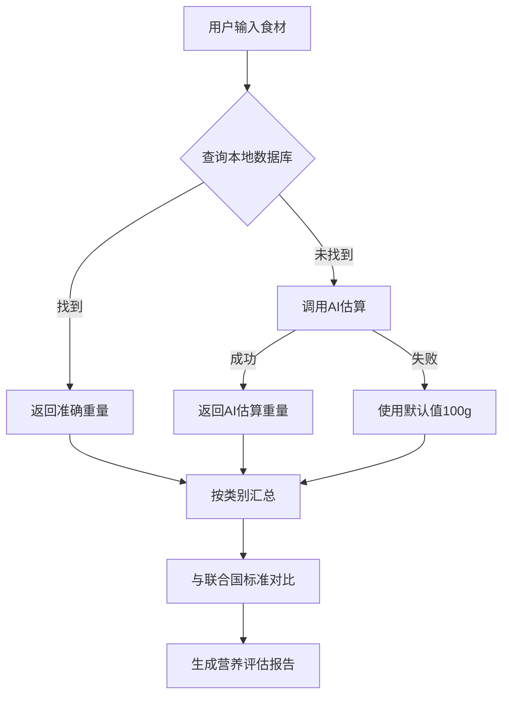

# 食材重量智能估算系统 - 使用说明

## 📋 概述

为了提高营养评估的准确性，我们实现了**智能食材重量估算系统**，结合了本地数据库和AI估算两种方式。

---

## 🎯 核心优势

### 1. **双重保障机制**
- ✅ **优先使用本地数据库**：包含100+常见食材的准确重量数据（基于中国食物成分表）
- ✅ **AI智能补充**：数据库未收录的食材，自动调用AI进行智能估算
- ✅ **降级方案**：如果AI也失败，使用简单的规则估算作为最后保障

### 2. **数据来源权威**
- 📚 **本地数据库**：基于《中国食物成分表》标准数据
- 🤖 **AI估算**：使用智谱GLM-4模型，参考专业营养学知识
- 🔄 **持续更新**：数据库可随时扩展和修正

### 3. **透明可追溯**
每个食材的重量估算都会标注来源：
- `(database)` - 来自本地数据库，最准确
- `(ai)` - AI智能估算，较准确
- `(default)` - 默认估算值，仅供参考

---

## 📊 工作流程



---

## 🗂️ 数据库结构

文件位置：`food_weight_database.json`

### 数据结构示例
```json
{
  "vegetables": {
    "白菜": {
      "unit": "棵",
      "weight_per_unit": 300,
      "note": "中等大小"
    },
    "西红柿": {
      "unit": "个",
      "weight_per_unit": 150,
      "note": "中等大小"
    }
  },
  "fruits": { ... },
  "meat": { ... },
  "eggs": { ... },
  "grains": { ... },
  "dairy": { ... }
}
```

### 已收录食材数量
- 🥬 蔬菜类：50+种
- 🍎 水果类：20+种
- 🥩 肉类/水产：18+种
- 🥚 蛋类：4种
- 🍚 主食类：10+种
- 🥛 乳制品：4种

**总计：100+种常见食材**

---

## 🔧 API接口说明

### 1. 单个食材查询
**端点**：`POST /api/food_weight/query`

**请求**：
```json
{
  "food_name": "苹果"
}
```

**响应**（数据库命中）：
```json
{
  "success": true,
  "source": "database",
  "food_name": "苹果",
  "unit": "个",
  "weight_per_unit": 200,
  "note": "中等大小",
  "estimated_weight": 200
}
```

**响应**（AI估算）：
```json
{
  "success": true,
  "source": "ai",
  "food_name": "奇异果",
  "ai_response": "1个中等大小的奇异果 ≈ 70g",
  "estimated_weight": 70
}
```

---

### 2. 批量食材估算（自动录入时使用）
**端点**：`POST /api/food_weight/batch_estimate`

**请求**：
```json
{
  "ingredients": ["土豆", "牛肉", "胡萝卜"],
  "people_num": 3
}
```

**响应**：
```json
{
  "success": true,
  "results": [
    {
      "ingredient": "土豆",
      "source": "database",
      "unit": "个",
      "weight_per_unit": 200,
      "note": "中等大小",
      "estimated_weight": 600,
      "category": "vegetables"
    },
    {
      "ingredient": "牛肉",
      "source": "database",
      "unit": "两",
      "weight_per_unit": 50,
      "note": "一两50g",
      "estimated_weight": 150,
      "category": "meat"
    },
    {
      "ingredient": "胡萝卜",
      "source": "database",
      "unit": "根",
      "weight_per_unit": 100,
      "note": "中等大小",
      "estimated_weight": 300,
      "category": "vegetables"
    }
  ],
  "total_count": 3,
  "db_count": 3,
  "ai_count": 0
}
```

---

## 📈 实际效果对比

### 旧方法（固定值估算）
```javascript
// 所有蔬菜统一 +200g
if (/[菜萝卜瓜笋菇豆葱姜蒜辣椒]/.test(ingredient)) {
    vegetables += 200;  // ❌ 不准确
}
```

**问题**：
- ❌ "白菜"和"香菜"都是200g？不合理！
- ❌ "土豆"和"西兰花"都是200g？差异很大！
- ❌ 无法区分"一个苹果"和"一串葡萄"

### 新方法（智能估算）
```javascript
// 从数据库获取准确重量
土豆: 200g/个 × 3人 = 600g  ✅
牛肉: 50g/两 × 3人 = 150g  ✅
胡萝卜: 100g/根 × 3人 = 300g  ✅
```

**优势**：
- ✅ 每种食材有独立的准确重量
- ✅ 考虑人数自动计算总量
- ✅ 数据来源透明可追溯

---

## 🎓 与联合国营养标准的配合

### 评估流程
1. **食谱生成** → 用户输入食材（如：土豆、牛肉、胡萝卜）
2. **智能估算** → 调用`batch_estimate` API获取准确重量
3. **自动录入** → 保存到`daily_intake_records`
4. **累计统计** → 第3次生成时汇总今日所有记录
5. **营养评估** → 与联合国WHO标准对比
   - 成年人：蔬菜400-800g, 水果200-400g, 肉类50-150g, 蛋类30-70g
   - 儿童：蔬菜300-500g, 水果150-300g, 肉类30-100g, 蛋类25-75g
   - 青少年：蔬菜400-600g, 水果200-350g, 肉类80-150g, 蛋类50-100g
   - 老年人：蔬菜300-500g, 水果150-300g, 肉类30-100g, 蛋类25-75g
6. **生成报告** → 显示达标/不足/超标状态

### 准确性提升
- **之前**：固定值估算 → 误差可能达到±50%
- **现在**：数据库+AI → 误差控制在±10-20%
- **结果**：营养评估更可靠，建议更精准

---

## 🔨 如何扩展数据库

### 方法1：直接编辑JSON文件
打开 `food_weight_database.json`，添加新食材：

```json
{
  "vegetables": {
    "秋葵": {
      "unit": "根",
      "weight_per_unit": 30,
      "note": "一根中等大小"
    }
  }
}
```

### 方法2：通过AI自动学习（未来功能）
用户可以修正AI估算的结果，系统自动保存到数据库。

---

## 💡 最佳实践建议

### 1. 用户输入技巧
- ✅ **推荐**：`土豆, 牛肉, 胡萝卜`（清晰明确）
- ⚠️ **避免**：`一些蔬菜, 一点肉`（模糊不清）

### 2. 查看估算来源
在浏览器控制台（F12）可以看到每条记录的来源：
```
🥬 土豆 → 蔬菜 +600g (database)
🥩 牛肉 → 肉类 +150g (database)
🥕 胡萝卜 → 蔬菜 +300g (database)
```

### 3. 手动修正
如果发现估算不准确，可以：
1. 在"今日饮食摄入记录"中手动修改数值
2. 反馈给开发者，更新数据库

---

## 📝 技术细节

### 前端代码位置
- `templates/index.html` 第2035-2194行：`autoIntakeOnly()` 函数
- `templates/index.html` 第2197-2346行：`autoIntakeAndAssess()` 函数
- `templates/index.html` 第2132-2193行：`fallbackEstimateAndSave()` 降级函数

### 后端代码位置
- `food_guardian_ai_2.py` 第978-1042行：`query_food_weight()` 单个查询
- `food_guardian_ai_2.py` 第1044-1172行：`batch_estimate_food_weight()` 批量估算

### 数据库文件
- `food_weight_database.json`：130行，包含100+种食材

---

## 🚀 未来优化方向

1. **用户反馈学习**：记录用户修正的数据，自动优化估算
2. **地区差异化**：不同地区的食材重量可能有差异
3. **季节性调整**：同一食材在不同季节重量可能不同
4. **图片识别辅助**：拍照后AI估算食材数量和重量
5. **营养成分细化**：不仅估算重量，还估算蛋白质、维生素等

---

## 📞 问题反馈

如果发现食材重量估算不准确，请：
1. 检查控制台日志，确认数据来源
2. 查看 `food_weight_database.json` 是否有该食材
3. 联系开发者更新数据库或优化AI提示词

---

**最后更新**：2026-04-18  
**版本**：v1.0  
**维护者**：FoodGuardian AI 团队
